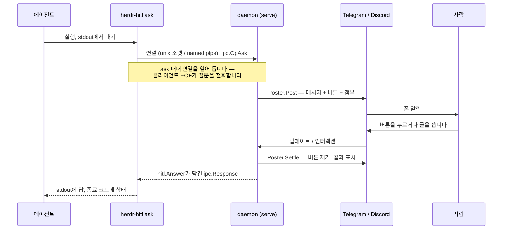

# herdr-hitl

*[English](README.md) · 한국어*

코딩 에이전트가 사람의 결정을 기다리며 멈출 수 있게 해주는 [Herdr](https://herdr.dev) 플러그인입니다. 답은 Telegram이나 Discord로 전달됩니다.

긴 작업 중인 에이전트는 혼자 결정하면 안 되는 지점을 만납니다 — 동료의 브랜치 위로 force-push, 두 마이그레이션 전략 중 선택, 읽을 수 없는 자격 증명, 이슈에 적히지 않은 요구사항. 지금까지 에이전트의 선택지는 둘뿐이었습니다. 추측하거나, 아무도 보지 않는 터미널 앞에서 멈추거나.

`herdr-hitl`은 세 번째를 줍니다. 명령 하나 — `herdr-hitl ask` — 가 질문을 당신의 폰으로 보내고, 버튼이나 입력 상자를 띄우고, 답을 기다린 뒤 stdout에 출력합니다. 종료 코드가 답을 받았는지, 시간이 다 됐는지, 거절당했는지를 알려줍니다.

## 빠른 시작

Herdr 플러그인으로 설치합니다 (바이너리를 빌드하고, Daemon을 띄우는 startup 훅을 등록합니다):

```sh
herdr plugin install huketo/herdr-hitl
herdr plugin action invoke huketo.hitl.config-init
herdr plugin action invoke huketo.hitl.install-cli
```

또는 CLI만 단독으로 설치합니다. 플러그인 매니페스트는 선택이고, Herdr 없이도 전부 동작합니다:

```sh
go install github.com/huketo/herdr-hitl/cmd/herdr-hitl@latest
```

메신저 하나를 설정하고 확인합니다:

```sh
$EDITOR "$(herdr-hitl config path)"
herdr-hitl doctor
herdr-hitl ask -t "연결 확인" -m "아무 글이나 보내주세요." --timeout 2m
```

### 질문은 어디로 갑니까

두 Transport 모두 **DM으로** 전달합니다. 다만 사전 조건이 다르고, 그 차이가 눈에 잘 띄지 않습니다.

| | Telegram | Discord |
| --- | --- | --- |
| 평소 사용 면 | 봇과의 DM | 봇과의 DM |
| 그룹·서버 필요? | **아니요** | **예 — 봇과 같은 서버에 있어야 합니다** |
| 한 번만 하는 준비 | 사람이 봇에게 먼저 말 걸기 (`/start`) | 봇을 당신이 속한 서버에 초대 |
| 건너뛰면 나는 오류 | `403 bot can't initiate conversation with a user` | `50278 no mutual guilds` |

Discord의 공유 서버는 **자격 증명 역할일 뿐 목적지가 아닙니다.** 그 서버에는 질문이 올라가지 않고 열어볼 일도 없습니다. 당신과 봇 둘뿐인 빈 서버로 충분합니다. 다만 그 서버를 나가거나 봇을 추방하면 DM이 다시 깨집니다.

팀이 질문을 봐야 한다면 그룹이나 채널을 가리키게 하십시오. 그때는 반드시 `allowed_user_ids`를 채우십시오 — 비워두면 그 공간의 누구나 당신 대신 결정할 수 있습니다.

**함정 하나: Telegram 채널.** 채널은 방송 전용이라 답장 상자가 없습니다. 버튼은 되지만 글로 쓰는 답은 구조적으로 불가능합니다. `herdr-hitl doctor`가 채널을 감지하면 그 사실을 알려줍니다.

## 설정

설정 디렉터리에 파일 두 개가 있습니다.

| 파일 | 용도 |
| --- | --- |
| `config.toml` | 비밀이 아닌 모든 것. `herdr-hitl config init`이 만듭니다. |
| `.env` | 토큰과 id. `.env.example`을 복사하고 `chmod 600`. |

위치:

| 플랫폼 | 설정 디렉터리 | 상태 디렉터리 |
| --- | --- | --- |
| Linux | `$XDG_CONFIG_HOME/herdr-hitl` (기본 `~/.config/herdr-hitl`) | `$XDG_STATE_HOME/herdr-hitl` (기본 `~/.local/state/herdr-hitl`) |
| macOS | `~/Library/Application Support/herdr-hitl` | `$XDG_STATE_HOME/herdr-hitl` (기본 `~/.local/state/herdr-hitl`) |
| Windows | `%APPDATA%\herdr-hitl` | `%LOCALAPPDATA%\herdr-hitl` |

이 위치는 Herdr가 실행해도 바뀌지 않습니다. Herdr는 플러그인 액션과 startup 훅에는 `HERDR_PLUGIN_CONFIG_DIR`·`HERDR_PLUGIN_STATE_DIR`을 주입하지만 에이전트가 질문하는 pane에는 주입하지 않습니다. 그것을 따르면 두 호출자가 서로 다른 설정을 읽고, 소켓이 상태 디렉터리에서 파생되므로 **봇 토큰 하나에 Daemon 두 개**가 붙습니다. 그래서 무시합니다. 유일한 재정의는 `HITL_CONFIG_DIR`과 `HITL_STATE_DIR`입니다. `herdr-hitl config path`로 실제 경로를 확인하십시오.

### `config.toml`

```toml
# --transport 없이 ask 할 때 사용할 Transport.
transports = ["telegram"]
# ask의 기본 마감. 0이면 무한정 기다립니다.
timeout = "30m"

[telegram]
enabled = true
bot_token = ""            # .env 쪽을 권장합니다
chat_id = "123456789"
allowed_user_ids = ["123456789"]   # 비우면 그 채팅의 누구나 답할 수 있습니다
api_base = ""             # 자체 호스팅 Bot API 서버를 쓸 때만

[discord]
enabled = false
bot_token = ""            # .env 쪽을 권장합니다
channel_id = ""           # 비우고 user_id를 채우면 DM으로 전달
user_id = ""
allowed_user_ids = []
message_content_intent = false   # 서버 채널에서 "일반 메시지" 답장이 필요할 때만

[daemon]
idle_shutdown = "0s"      # 0이면 계속 상주
log_level = "info"        # debug | info | warn | error

[herdr]
notifications = true      # Herdr 알림 표면에도 질문을 띄웁니다
pane_tokens = true        # 대기 상태를 pane 토큰으로 노출합니다
```

### 환경 변수

| 변수 | 덮어쓰는 값 | 별칭 |
| --- | --- | --- |
| `HITL_TELEGRAM_BOT_TOKEN` | `telegram.bot_token` | `TELEGRAM_BOT_TOKEN` |
| `HITL_TELEGRAM_CHAT_ID` | `telegram.chat_id` | `TELEGRAM_CHAT_ID` |
| `HITL_DISCORD_BOT_TOKEN` | `discord.bot_token` | `DISCORD_BOT_TOKEN` |
| `HITL_DISCORD_CHANNEL_ID` | `discord.channel_id` | `DISCORD_CHANNEL_ID` |
| `HITL_DISCORD_USER_ID` | `discord.user_id` | — |
| `HITL_TRANSPORTS` | `transports` (쉼표 구분) | — |
| `HITL_TIMEOUT` | `timeout` | — |
| `HITL_LOG_LEVEL` | `daemon.log_level` | — |
| `HITL_IDLE_SHUTDOWN` | `daemon.idle_shutdown` | — |
| `HITL_HERDR_NOTIFICATIONS` | `herdr.notifications` | — |
| `HITL_HERDR_PANE_TOKENS` | `herdr.pane_tokens` | — |
| `HITL_CONFIG_DIR` | 설정 디렉터리 | — |
| `HITL_STATE_DIR` | 상태 디렉터리 | — |
| `HITL_SOCKET` | Daemon 엔드포인트 경로 | — |
| `HITL_AGENT` | `--agent` 기본 라벨 | — |

## CLI 레퍼런스

### `ask` — 질문을 보내고 답이 올 때까지 멈춥니다

| 플래그 | 뜻 |
| --- | --- |
| `-t, --title string` | 한 줄 요약. 메시지 제목으로 나옵니다. |
| `-m, --message string` | 질문 본문, Markdown. `-`이면 stdin을 읽습니다. |
| `--message-file PATH` | 본문을 파일에서 읽습니다. |
| `-c, --choice strings` | 반복 가능. `id=라벨` 또는 라벨만 (id는 라벨에서 만듭니다). |
| `--primary strings` | 긍정·기본 버튼으로 표시할 선택지 id. |
| `--danger strings` | 파괴적 버튼으로 표시할 선택지 id. |
| `--free` | 글로 쓰는 답을 허용합니다. 기본 `true`. `--free=false`면 선택지만. |
| `-a, --attach strings` | 반복 가능. 이미지나 문서 경로 (`.md`, `.html`, `.png`, …). |
| `--timeout duration` | 마감. 기본은 설정값(`30m`). `0`이면 무한정. |
| `--transport strings` | `telegram`, `discord`. 기본은 설정값. |
| `--agent string` | 사람에게 보일 라벨. 기본 `$HITL_AGENT`, 없으면 `agent`. |
| `--default string` | 마감이 지나면 실패 대신 이 텍스트를 출력합니다. |
| `-o, --format string` | `text` 또는 `json`. 기본 `text`. |

`-o text`는 stdout에 **답 텍스트만** 출력합니다. 그래서 명령 치환이 그대로 동작합니다. 로그와 진단은 전부 stderr로 갑니다. `-o json`은 `hitl.Answer` 객체를 출력합니다.

```sh
ANSWER=$(herdr-hitl ask \
  -t "main에 force-push 할까요?" \
  -m "리베이스로 머지 커밋 2개가 사라졌습니다. force-push 할까요, PR을 열까요?" \
  -c "push=Force-push" -c "pr=PR 열기" \
  --danger push --primary pr --free=false --timeout 15m)
```

### `notify` — 답을 기다리지 않는 알림

플래그: `-t/--title`, `-m/--message`, `--message-file`, `-a/--attach`, `--transport`, `--agent`.

```sh
herdr-hitl notify -t "마이그레이션 완료" -m "42개 테이블, 오류 0건, 6분 12초." -a report.md
```

### `pending` — 답을 기다리는 질문 목록

```sh
herdr-hitl pending -o json
```

### `answer` — 메신저 대신 터미널에서 답하기

```sh
herdr-hitl answer a3f19c7b0e42 --choice pr
herdr-hitl answer a3f19c7b0e42 --text "pgbouncer 쓰세요"
```

### `cancel` — 질문 철회

```sh
herdr-hitl cancel a3f19c7b0e42 --reason "마이그레이션 가이드를 읽고 해결됨"
```

### `serve` — Daemon을 포그라운드로 실행

메신저 연결을 붙들고 CLI 클라이언트를 받습니다. 다른 Daemon이 이미 엔드포인트를 가지고 있으면 조용히 `0`으로 종료합니다. 분리된 Daemon을 띄우려면 `daemon start`를 쓰십시오.

```sh
herdr-hitl serve
```

### `daemon` — 수명 관리

```sh
herdr-hitl daemon start
herdr-hitl daemon status -o json
herdr-hitl daemon restart
herdr-hitl daemon stop
```

### `doctor` — 진단

```sh
herdr-hitl doctor -o json
```

### `config` — 확인과 생성

```sh
herdr-hitl config path
herdr-hitl config show
herdr-hitl config init
```

### `install-cli` — 바이너리를 PATH에 놓기

```sh
herdr-hitl install-cli --dir ~/.local/bin
```

### `version`

```sh
herdr-hitl version -o json
```

### 종료 코드

| 코드 | 뜻 |
| --- | --- |
| `0` | 답을 받았습니다. (또는 `notify` 전송 성공, 기타 명령 성공.) |
| `1` | 오류 — Transport 없음, 토큰 오류, Daemon 도달 불가, 전송 실패. |
| `2` | 사용법 오류 — 없는 플래그, 빠진 필수 플래그, 잘못된 값. |
| `3` | 시간 초과 — 마감까지 답이 없었습니다. `--default`가 이것을 `0`으로 바꿉니다. |
| `4` | 취소 또는 거절 — 사람이 물리쳤거나 Daemon이 취소 지시를 받았습니다. |

## 메신저 설정

- [docs/setup-telegram.ko.md](docs/setup-telegram.ko.md)
- [docs/setup-discord.ko.md](docs/setup-discord.ko.md)

## Agent Skill

Skill은 저장소 안 [`skills/herdr-hitl/SKILL.md`](skills/herdr-hitl/SKILL.md)에 있습니다. 에이전트에게 *언제* 물어볼지를 가르치는 문서입니다. Skill을 읽지 않은 에이전트는 절대 묻지 않습니다.

### `npx skills` 사용 (권장)

[`skills`](https://github.com/vercel-labs/skills)는 Claude Code, Cursor, Codex, Copilot, opencode 등 70여 개 하네스를 지원하는 Skill 설치 도구입니다.

```sh
npx skills add huketo/herdr-hitl
```

저장소를 클론하고 `skills/` 규약에 따라 `skills/herdr-hitl/SKILL.md`를 찾아 에이전트의 Skill 디렉터리에 연결합니다. 별도의 매니페스트가 필요 없습니다. 자주 쓰는 변형:

```sh
npx skills add huketo/herdr-hitl -g                                   # 모든 프로젝트에 설치
npx skills add huketo/herdr-hitl --skill herdr-hitl -a claude-code -y # 비대화식
npx skills add huketo/herdr-hitl#v0.1.0                               # 태그 고정
npx skills add ./                                                     # 로컬 체크아웃에서
npx skills list                                                       # 설치된 것 확인
npx skills update herdr-hitl                                          # 새 버전 반영
```

정본은 `.agents/skills/herdr-hitl`(전역이면 `~/.agents/skills/…`)에 두고, 선택한 각 에이전트 디렉터리가 그것을 심볼릭 링크로 가리킵니다. 그래서 한 번 갱신하면 모든 하네스에 반영됩니다.

> 패키지 이름은 **복수형 `skills`** 입니다. 단수 `npx skill`은 전혀 다른 패키지이고, 하드코딩된 저장소 하나에서만 설치할 수 있어 `huketo/herdr-hitl`을 거부합니다.

### 직접 연결

Node가 없거나, Herdr가 관리하는 체크아웃을 따라가게 하고 싶을 때:

```sh
# 설치된 플러그인에서 — plugin_root가 Herdr의 체크아웃 위치입니다.
ROOT=$(herdr plugin list --plugin huketo.hitl --json | jq -r '.result.plugins[0].plugin_root')
ln -s "$ROOT/skills/herdr-hitl" ~/.claude/skills/herdr-hitl

# git 체크아웃에서
ln -s "$PWD/skills/herdr-hitl" ~/.claude/skills/herdr-hitl
```

복사가 아니라 심볼릭 링크로 거십시오. 그래야 플러그인을 갱신하면 Skill도 함께 갱신됩니다.

Skill 본문은 **의도적으로 영어로만** 유지합니다. CLI 플래그와 종료 코드가 영어이고, 트리거 설명이 겹치는 Skill 두 개를 두면 둘 다 발동하면서 서로 어긋나기 때문입니다. 문서 드리프트 검사는 한국어 문서까지 감시하지만, Skill은 영문 원본 하나뿐입니다. [ADR-0003](docs/adr/0003-agent-skill-distribution.md)을 보십시오.

## 구조

Daemon이 존재하는 이유는 메신저 API가 봇 토큰당 **하나의 장수 연결**을 요구하기 때문입니다. Telegram의 업데이트 큐는 토큰마다 하나뿐이고 읽으면 사라집니다. Discord는 IDENTIFY를 24시간에 1000회로 제한하고, 초과하면 봇 토큰을 초기화합니다. [ADR-0001](docs/adr/0001-blocking-cli-over-a-resident-daemon.md)을 보십시오.



## 개발

```sh
make build   # -> bin/herdr-hitl
make test    # go test -race
make lint    # golangci-lint
make cover   # coverage.out + 요약
make check   # vet + lint + test
```

작업 트리를 Herdr에 연결할 때는 `plugin link`가 빌드 명령을 실행하지 않으므로 먼저 빌드하십시오:

```sh
make build && herdr plugin link "$PWD"
```

도메인 용어는 [CONTEXT.md](CONTEXT.md)에, 결정은 [docs/adr/](docs/adr/)에 있습니다.

## 라이선스

MIT. [LICENSE](LICENSE)를 보십시오.
